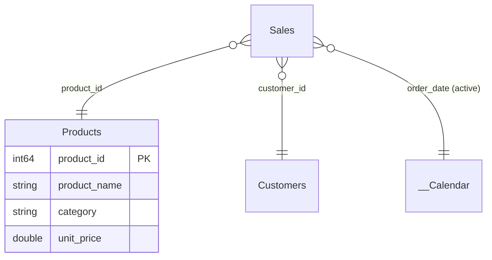

# Hand the spec to a data engineer

**Goal:** package a validated model as a spec an engineer can build the real
warehouse model from. The deliverable is a **diagram + an openable PBIP**, not a
dashboard.

## 1. Confirm the gate is green

```powershell
tmdl-preflight check out/<Domain>
# tmdl-preflight: 0 error(s), 0 warning(s), 0 info(s)
```

Only hand over a model at **0 errors**. That is the claim you can defend: the
project is *structurally openable*.

## 2. Draw the star schema

Produce a diagram of tables (with column names and types), the measures, and the
relationships as `Fact.fk -> Dim.key`. A Mermaid `erDiagram` renders well and
travels in a chat or a README:



This is the part engineers actually build against: which tables, which keys,
which types, which metrics.

## 3. Include the PBIP and how to open it

- The path: `out/<Domain>/<name>.pbip`.
- One line: "open `<name>.pbip` in Power BI Desktop." The sample data is loaded,
  so relationships resolve and measures compute — intent is unambiguous.

## 4. State the boundaries honestly

- tmdl-preflight proves **structure**, not a live Desktop render. If a Desktop
  open matters, say it is a human verification step.
- The `.Report` is **blank on purpose** — the value is the model. See
  [A spec for data engineers](../explanation/spec-for-data-engineers.md).
- The sample data is **illustrative**. Engineers replace the entered-data
  partitions with real warehouse sources; the tables, keys, types, relationships
  and measures are the contract to preserve.

## 5. Note what production still needs

Call out the human follow-ups so nothing is assumed done: a real Desktop open,
publishing to a workspace, and swapping sample data for production sources.
