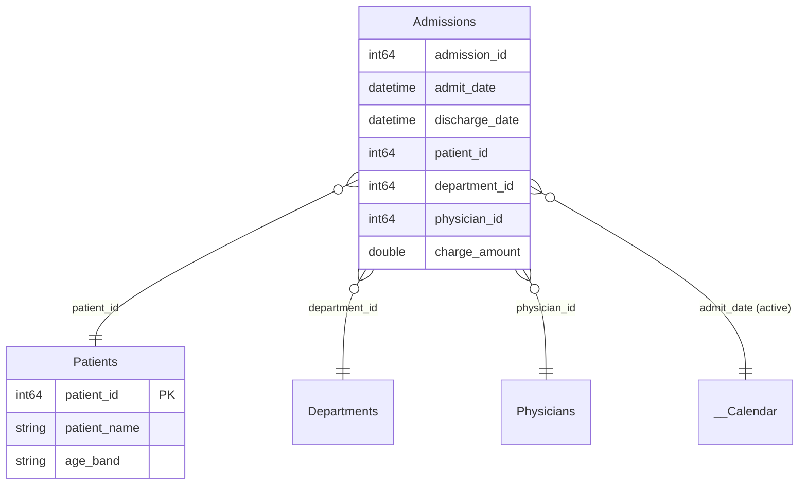

# Getting started

In this tutorial you will install the validator, build the seed template that
ships with the repo, prove it opens (0 errors), and then run your first
"create a sample data model for &lt;domain&gt;" pass — ending in a diagram-style
spec you could hand to a data engineer. It takes about ten minutes and assumes
a working Python 3.9+ installation.

Every command below is real. Run them from the repository root.

## 1. Install tmdl-preflight (the gate)

The builder itself has no pip dependencies, but the workflow is only trustworthy
with the validator. `tmdl-preflight` is your own local package (not on PyPI) —
install it editable from its folder and confirm it is on PATH:

```powershell
pip install -e C:\Users\<you>\Desktop\tmdl-preflight
tmdl-preflight --version
# tmdl-preflight 0.1.0
```

If `tmdl-preflight --version` fails, stop here and fix the install — nothing
downstream can prove a model opens without it. See
[Install & verify tmdl-preflight](../how-to/install-and-verify-tmdl-preflight.md).

## 2. Build the seed template

The repo ships a canonical worked example: a small retail-sales star schema
(`Customers`, `Products`, `Sales` fact, a calculated `__Calendar`, and a
`Measures` table) with four relationships. Build it:

```powershell
python scripts/build_template.py
# Built template PBIP: ...\pbip-model-forge\template\Model.pbip
```

This writes the full PBIP under `template/` — `Model.pbip`,
`Model.SemanticModel/` (the TMDL definition with data physically loaded), and a
blank `Model.Report/`. No pip install is required for this step; the script puts
`src/` on the path itself.

## 3. Check it — must be 0 errors

Point the validator at the project you just built:

```powershell
tmdl-preflight check template
# tmdl-preflight: 0 error(s), 0 warning(s), 0 info(s)
```

Exit code 0 means the model is **structurally openable** — every file in the
[artifact checklist](../reference/artifact-checklist.md) is present, every table
is attached and has a partition, and no rule (M001–M008) fired. This is the gate
the whole workflow leans on: **0 errors is the definition of "done".**

## 4. (Optional) open it in Power BI Desktop

On Windows with Power BI Desktop installed, open `template/Model.pbip`. The
diagram view shows the four tables wired to the fact, and the sample data is
already loaded — measures compute, relationships resolve. tmdl-preflight proves
*structure*; opening in Desktop is the human confirmation of a live render.

## 5. See the numbers — guided matrix creation

The blank report is deliberate — the *spec* is the deliverable, not a
dashboard. But the reason the builder loads real data (rather than leaving
tables empty) is so the model actually **computes**: a domain expert can read
their spec's numbers before handing it off. Open `template/Model.pbip` in
Power BI Desktop and add a **Matrix** visual (Build pane → Matrix). Three
matrices, and exactly what the eight seeded `Sales` rows aggregate to:

**Matrix 1 — Revenue by product category.** Rows: `Products[category]`;
Values: `[Revenue]`.

| category | Revenue |
|---|---|
| Services | $ 1,720.00 |
| Subscriptions | $ 2,176.00 |
| **Total** | **$ 3,896.00** |

**Matrix 2 — a KPI grid by customer segment.** Rows: `Customers[segment]`;
Values: `[Revenue]`, `[Orders #]`, `[Units Sold]`, `[Average Order Value]`.

| segment | Revenue | Orders # | Units Sold | Avg Order Value |
|---|---|---|---|---|
| Enterprise | $ 1,912.00 | 3 | 16 | $ 637.33 |
| Mid-Market | $ 196.00 | 1 | 4 | $ 196.00 |
| SMB | $ 1,788.00 | 4 | 14 | $ 447.00 |
| **Total** | **$ 3,896.00** | **8** | **34** | **$ 487.00** |

**Matrix 3 — a time view off the calendar.** Rows:
`__Calendar[Calendar Year]`; Values: `[Revenue]`.

| Calendar Year | Revenue |
|---|---|
| 2024 | $ 2,902.00 |
| 2025 | $ 994.00 |
| **Total** | **$ 3,896.00** |

Those totals reconcile (every matrix sums to $3,896.00 across the 8 orders) —
the relationships resolve and the measures compute against the loaded data.
The same move works on any model `create-sample-model` generates: on a
PhysioClinic model, drop `Therapists[specialty]` on Rows and `[Total Revenue]`
/ `[No-Show Rate]` on Values to read no-show behaviour by specialty. That
matrix — a handful of aggregated numbers a stakeholder immediately
understands — is the payoff of speccing the model in the first place.

## 6. Your first "create a sample data model for &lt;domain&gt;" pass

Now the actual product. In a Claude Code session in this repo, ask:

> create a sample data model for a hospital

The [`create-sample-model`](../../.claude/skills/create-sample-model/SKILL.md)
skill takes over and:

1. **Designs a star schema** for the domain — one hidden fact table (e.g.
   `Admissions`, one row per visit) with foreign keys and date columns, 2–4
   dimensions (`Patients`, `Departments`, `Physicians`), a calculated
   `__Calendar`, and a `Measures` table with a few DAX measures.
2. **Invents realistic sample rows** — believable names, categories, dates
   spread across the calendar range.
3. **Builds the PBIP** by calling `build_pbip(spec, "out/Hospital")`. It never
   hand-writes TMDL or base64 — the builder guarantees the structure.
4. **Runs the gate** and iterates until clean:

   ```powershell
   tmdl-preflight check out/Hospital
   # tmdl-preflight: 0 error(s), 0 warning(s), 0 info(s)
   ```

You can verify the artifacts yourself: `out/Hospital/Hospital.pbip` (or whatever
name the spec used) and its `.SemanticModel` / blank `.Report` folders now exist,
and `tmdl-preflight check out/Hospital` returns 0 errors.

## 7. The deliverable: a diagram-style spec

The skill presents the model as a diagram a data engineer can build against — a
Mermaid `erDiagram` reads well:



…alongside the path to the PBIP, a one-line "open `Hospital.pbip` in Power BI
Desktop" note, and the tmdl-preflight result (0 errors) as proof it is
structurally openable. That package — diagram plus openable PBIP — *is* the spec
you hand to your data engineers.

Note: the generated `.Report` is intentionally blank. The value is the *model*,
not a dashboard; see [A spec for data engineers](../explanation/spec-for-data-engineers.md).

## Where to go next

- [Build a model from a domain prompt](../how-to/build-a-model-from-a-prompt.md) —
  the recipe, condensed.
- [Expand a model and keep it valid](../how-to/expand-a-model-and-keep-it-valid.md) —
  add tables, measures and relationships without breaking the open.
- [The `build_pbip` spec schema](../reference/spec-schema.md) — every key you can
  put in a spec.
- [The "will it open" playbook](../explanation/will-it-open.md) — why the gate
  exists and what each rule protects.
